# High Frequency Trading using Support Vector Machines
This project implements a high frequency trading strategy that utilizes Support Vector Machines to capture statistical arbitrage in the pricing of Class A and Class C Google stocks. 

We will demonstrate a trading algorithm that earns great profits (~53% returns over 2 years) with a sharpe ratio of 11.

This idea is heavily inspired by the following paper: http://cs229.stanford.edu/proj2015/028_report.pdf by Jiayu Wu. This project includes modifications into a trading strategy that rebalances the beta ratio. 

TODO: Further Model Tuning, Model Explanations, Diagnostic Graphs on labelling, Labelled profit vs. Unlabelled profit

## Abstract
D.S. Ehrman defines Pairs Trading as a nondirectional, relative-value investment strategy that seeks to
identify two companies with similar trading characteristics whose equity securities are currently trading at a range outside their historical range. 
This investment strategy entails buying the undervalued security while short-selling the overvalued security; thereby maintaining market neutrality.
The position should be closed once the instruments return to statistical norms, earning the trader a profit. A good pair should share as many the same intrinsic characteristics as possible. 

In our project, we will be searching for pairs trading opportunities between Class A and Class C Google stocks. Since all of the underlying fundamentals of both instruments are similar with the exception of voting rights, this pair makes a very good candidate to explore. 

However, since this pair of of instruments is obviously closely related, many other players in the market are ready to profit off of any mispricings within this pair. It is not expected for any mispricings to be available for a long time. As such, we need to work in a timeframe that is as fast-paced as possible. That is why we will be using a fast-paced high frequency pairs trading strategy to capture statistical arbitrage within the pricing of GOOGL and GOOG as soon as they occur. In our project, we will be creating features from the ticker data that we feed into a machine learning model to predict profitable pairs trading opportunities. 

## Dataset
Our dataset contains snapshots of GOOG and GOOGL over the span of roughly 2 years (10/2016 - 11/2018) at the minute-level resolution. 
Our data was gathered from QuantQuote.com, a reputable dealer of fine-resolution ticker datasets. 
Our dataset had some missing values for both tickers. From QuantQuote's website: "Missing data for certain minutes generally means that no trades occurred during that minute." 
We handled this by removing entries from both datasets in which at least 1 of the tickers had a missing entry. The reasoning behind this was that is that pairs trading is impossible in such instances. This only occured for about 0.1% of our dataset. 

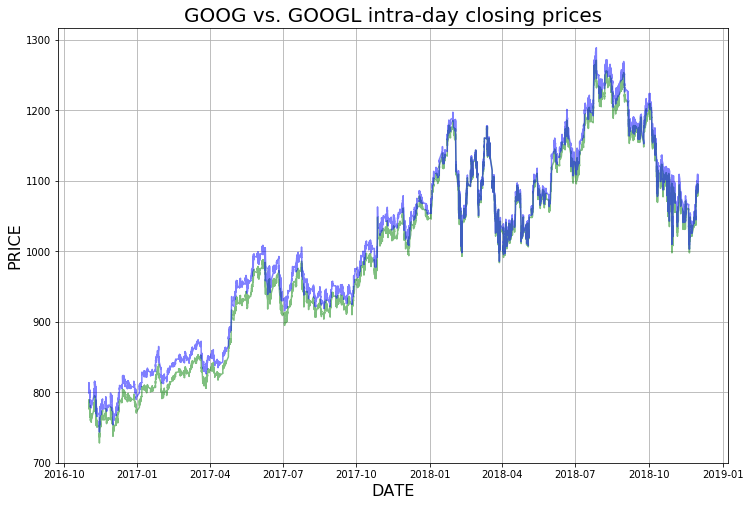

## Pairs Trading Model
The canonical pairs trading spread model looks like: 

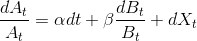

where 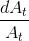 represents the returns of instrument  at time  and 
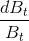 represents the returns of instrument  at time . 

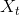 represents the spread of the returns at time . One of the assumptions of this model 
is the fact that this residual term is mean-reverting. We can assume this especially since the intrinsic characteristics 
of both securities in this instance are very similar. 

 represents the drift term. Sometimes the spread begins to trend instead of reverting to the original mean. The drift term is one of the biggest factors of risk in pairs trading. For our problem, we assume that the drift term is negligible compared to the returns of either instrument. 

 represents the hedge ratio which serves to normalize the volatility between the instruments. 
 tells us how much of instrument  to long/short for every 1 unit of  to long/short, creating a risk neutral position. We will use the close prices to calculate percent returns and for the other features. Past work has considered assumed that  remains constant over the duration of the dataset. For our dataset, however, different behavior in the spread is apparent in 2017 and 2018. This might be due to some change of intrinsic characteristics of the instruments. For our solution, we will assume treat  as variable and recalculate it periodically. 

## Ornstein-Uhlenbeck (OU) Stochastic Process

The Ornstein-Uhlenbeck Stochastic Process is used in finance to model the volatility of the underlying asset price process. The process can be considered to be a modification of the random walk (Weiner Process) in which the properties of the process have been changed so that there is a tendency to walk back towards a central location. The tendency to move back towards a central location is greater when the process is further away from the mean. Thus, this process is called "mean-reverting", and has many direct applications in pairs trading. 

The OU process satisfies the following stochastic differential equation: 

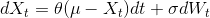

where  > 0, ,  represent parameters, 
and 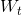 denotes the Weiner process (standard Brownian motion process).

 is the spread of the two instruments at time . 

 measures the speed of  returning to its mean level, denoted by . 

 represents the volatility of the spread. 

In this project, we will start from the difference of returns at time . Then we will 
integrate this process and use a linear regression to estimate the parameters ,, and . 

These parameters are used later for feature generation. 

## Features

Typically, trading strategies will only apply the spread model to the price of the instruments. In this project, however, 
we will extend it to also include the spread of some technical indicators, namely Simple Moving Average (SMA), Exponentially Weighted Moving Average (EWMA), Money Flow Index (Money Flow Index), and Relative Strength Index (Relative Strength Index). 

The calculation for each of these features is detailed here: 

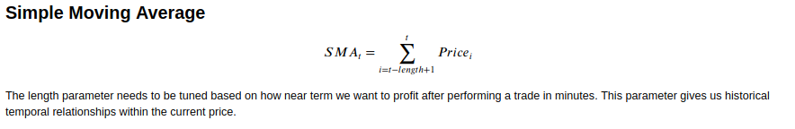

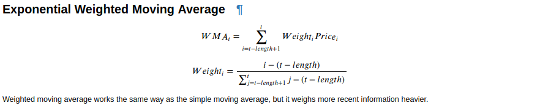

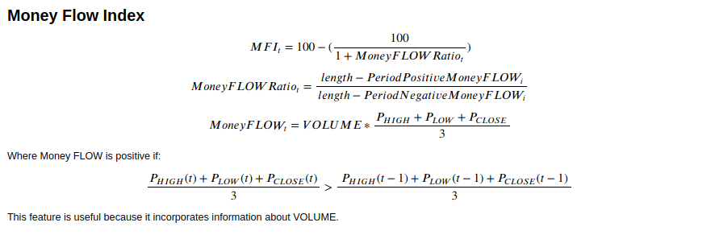

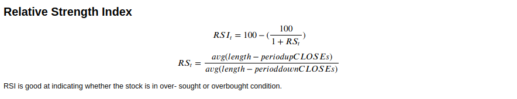

We can extend the spread model to include these technical indicators in addition to price because they exhibit similar 
behaviors for both instruments of the pair. Furthermore, it will provide more context to the classifier in addition to the price. 

## Feature Generation Steps

These are the steps to follow to process the data for the Support Vector Machine algorithm to be used.

1. Split dataset into train and test partitions.

2. Calculate features (price, sma, ewma, mfi, rsi) for each instrument.

3. Calculate percent change for each feature.

4. Run linear regression on the features of the training partition of instrument A and B. 
This serves to estimate  according to the pairs trading spread model mentioned above. 
It also calculates the residual term 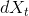.

5. Construct the spread terms  with the following equation: 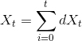.

6. Run lag 1 auto-regression on spread terms to get parameters according to OU model. 

7. Calculate T-scores for each individual feature according to the following equation: 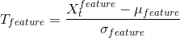

8. Transform the testing dataset by finding the spread residuals  
by using the  obtained in the training set. 

9. Construct the spread terms  of the testing dataset using the following equation: .

10. Calculate the T-scores for each individual feature in the testing partition by using the  
and  calculated for the training partition for each feature. 

At the end of this step, we have fitted the pairs trading spread model parameters and the OU process parameters to the training partition. 

Furthermore, we have transformed both the training and testing partitions according to the parameters and calculated the T-score for them. 

## Support Vector Machine

Support Vector Machines (SVM) is an effective machine learning algorithm for 
classification. The goal is to find a hyperplane that separates two classes 
of data maximizes the margin between the classes. 

### Label Generation

Though SVMs can be used for multi-class classification, we will only be 
utilizing it for binary classification in this instance for simplicity's sake. 
We define the labels for the classes as follows: 

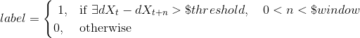

If the residual of the spread drops, that means there is profit to be made 
by shorting instrument A and longing instrument B before the residual drops. 
We want to label the instances leading up to the shift in residual as a 1, 
which indicates a profitable trading entry position. Otherwise we label the 
instance as 0 indicating that we should stay calm and do nothing. We hold on 
to the position for $window amount of minutes until either the residual 
actually drops, or we run out of time and offload our position. 
$threshold should be adjusted to the amount of profitability per trade, 
with a higher threshold corresponding to higher per-trade profit, 
but with less opportunities. 

In our implementation, we set the $threshold parameter to 0.0005, leading 
to around 1/3 of our dataset to have a label of 1. 

Furthermore, we set our $window parameter to 5. This means that if the 
residual drops by the $threshold amount within 5 minutes from the current 
time, we will label the data point with a 1. The reason for this number 
is because we want to minimize the exposure of holding the position 
for a long time. 

### Model Size

Jiayu Wu's paper splits the dataset into a single 80/20 train-test split 
for evaluation. Our method utilizes a sliding window approach for validation. 
The reason for this is because the  value between 
these two instruments is changing due to market conditions. As mentioned 
earlier in this document, there is a noticeable shift in the relationship 
between our two instruments in 2017 and 2018. We want to be able to capture 
the fine-grain trend of the relationship of these two instruments, so we 
should be constantly recalculating our parameters. 

Because of this, we decided to evaluate our algorithm using a sliding 
window size of 2000 for parameter calculation and a evaluation window 
size of 100 for backtesting. The reasoning behind this is that 
our sliding window size of 2000 is big enough to capture the current 
trend of the spread and our evaluation window size of 100 serves to 
ensure that our model is consistently updated with recent changes. 

Here is an example of our sliding window approach with numbers corresponding to indices: 

Example split_sliding(m_size=30000, e_size=10000)

Fold 1: TRAIN: [0:30000] TEST: [30000:40000]

Fold 2: TRAIN: [10000:40000] TEST: [40000:50000]

Fold 3: TRAIN: [20000:50000] TEST: [50000:60000]

Fold 4: TRAIN: [30000:60000] TEST: [60000:70000]

Fold 5: TRAIN: [40000:70000] TEST: [70000:80000]

Stratifying our data like this leads to the creation of 2005 folds. 

Below is a visualization of how we are using our t-scored data in this sliding window approach. 

### SVM Hyperparameter Tuning

In order to increase the chances of finding the best set of hyperparameters 
for our SVM, we need to perform a gridsearch over a set of possible candidate 
hyperparameters. 

Our grid search was done over the following set of hyperparameters: 

params = [{ 'kernel': ['rbf'],
            'C': [0.1,1,10,100], 
            'gamma': [1, 0.1, 0.001, 0.0001], 
            'cache_size': [2000], 
            'class_weight': [{0: 0.5, 1: 0.5}, {0: 0.6, 1: 0.4}, 
                             {0: 0.7, 1: 0.3}, {0: 0.8, 1: 0.2}]
          }, 
          { 'kernel': ['poly'], 
            'C': [0.1, 1,10,100,], 
            'gamma': [1, 0.1, 0.001, 0.0001],
            'degree': [3, 5],
            'cache_size': [2000],
            'class_weight': [{0: 0.5, 1: 0.5}, 
                             {0: 0.6, 1: 0.4}, {0: 0.7, 1: 0.3}]
          }]

The entire process of fit-transforming out data to the OU process 
followed by training and evaluating 320,800 hyperparameter combinations 
on all 2005 folds took around 12 hours on an intel i9-9900k. This could have 
been sped up using dask's GridSearchCV implementation. 

One thing to note is that the SVM library that scikit-learn uses (libSVC). 
The training and inference speeds using the 'rbf' kernel is empirically 
10x faster than that of 'poly' kernel. This is important to factor into 
our rebalancing strategy because in high frequency trading, 
speed is very important. 

The metric we used when selecting the best set of hyperparameters factored 
in two things: 

1. Frequency of trades
2. Precision of trades

The amount we trade is important because it directly affects how profitable our 
trading strategy is. We need to be squeezing as many profitable trading instances 
as possible. 

The precision of trades is important because we need to make sure that we make money 
on each trade. 

The total profitability of our algorithm can be approximated by: 

(Number of trades) * (Money made per profitable trade) * (Precision of trades)

The parameter set that demonstrated the best performance under the above mentioned 
metrics was this one: 

params = {'C': 100,
   'cache_size': 2000,
   'class_weight': {0: 0.5, 1: 0.5},
   'gamma': 1,
   'kernel': 'rbf'}

## Backtesting

We backtested across all folds using the transformed and scaled t-scores mentioned in the earlier section. One important thing to realize was that we didn't allow our strategy to enter a position whenever the residual was below zero. The reason for this being that betting on the spread to narrow when it was already narrower than expected led to a huge decrease in profits. This needs to be integrated into the SVM training for future steps. 

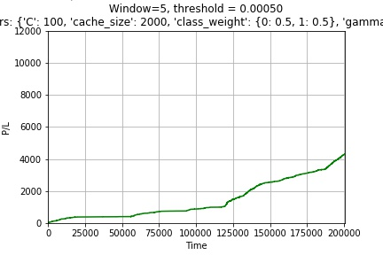

The total profit and loss for our strategy over 2 years was $3444.43 for a return on investment of 35%. Notice that the profits for the latter half of the time period was much more than the profits for the initial half. More research needs to be done on why the model performance varied across time. Also notice that the return on investment is not a precise figure, since we don't utilize 100% of our maximum amount invested at all times. That situation only happens when we trade 5 times in a row and hold 5 pairs trading positions. 

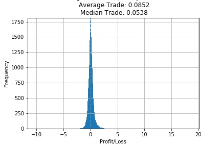

The total profit/loss per trade shows that we are making on average 11 cents per trade. We are making around 30,000 total trades out of a possible 200,000 trading opportunities over the past 2 years. Our trading precision (percent of trading opportunities are actually correct) is around 70.5%, which is quite good given that only ~33% of the dataset contains a trading signal. 

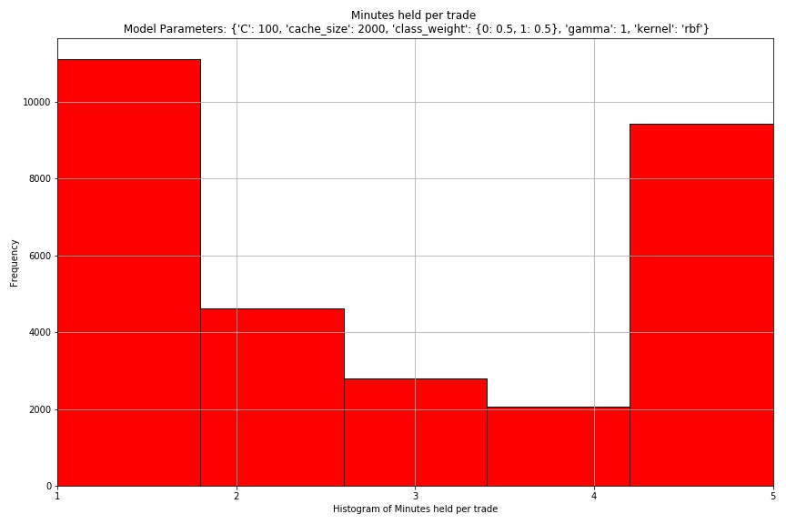

This histogram shows the minutes held per trade. It can be seen that most of the trades are held for either 1 minute, or 5 minutes. This means that the trades we execute either immediately revert back to the mean within the next tick, netting us profit, or time out. This shows that our window size was adequetely chosen for this problem. 

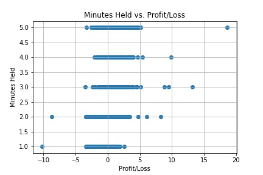

This plot shows the profitability of each trade based on the minutes held. It can be seen that the longer that the trade is held, the less profitable it usually is. This further validates the assumption that many instances of the spread being larger than normal shows correction almost immediately. 

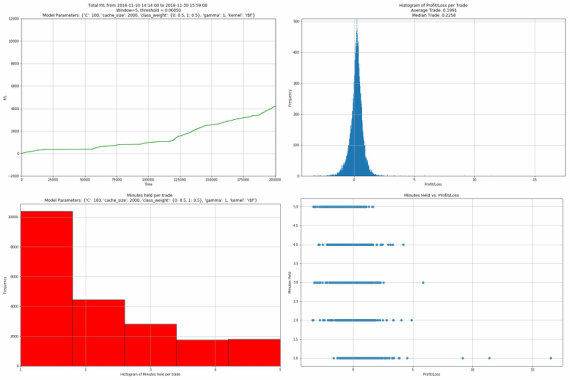

Above shows the plots for only the correct trades (where the spread actually narrows) we have made with our SVM strategy. As you can see, we make about $800 more, with an mean average trade of almost 20 cents per trade. As can be seen by the minutes held histogram, it seems like a majority of the correct trades are only held for around 1 minute - further indicating the fast mean reversion process. 

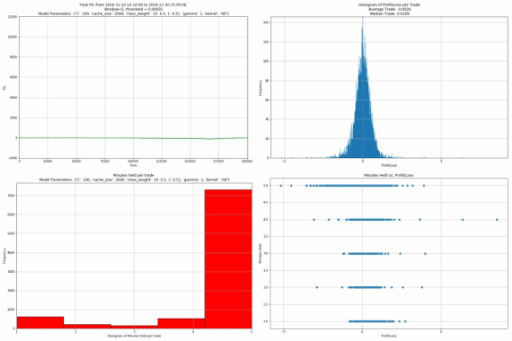

The incorrect plots have a slightly negative profit, with a mean trade of -0.2 cents per trade. This is good because our correct trades make a decent amount of money per trade, while our incorrect trades are almost break-even. This is very beneficial to our high frequency trading strategy because errors are forgiving. 

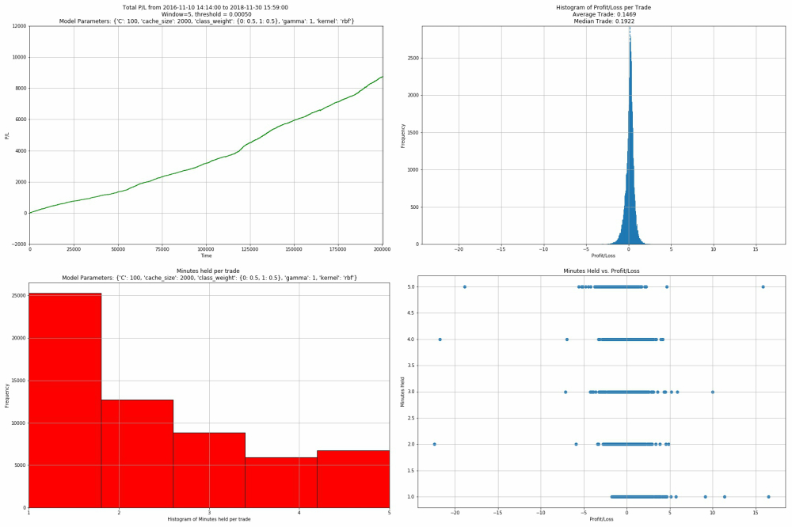

The following plots show what our results would be if our model was completely clairvoyant (trading only when we knew the spread would narrow). The P/L graph shows that there is a maximum possible $9,000 dollars to be squeezed from this strategy. Since our model captures around $3,400, it means that we are approximately capturing 40% of the maximum profit possible from this strategy. Interestingly, the clairvoyant model only has an average of 14 cents of profit per trade, which is lower than the average profit per trade of only the correct trades made by our model. This means that our model, when it does guess correctly, tends to capture higher profit trades on average than the clairvoyant model. This information could be useful for deciding which positions might be more profitable than others. 

# Further Exploration

In this project, we detailed the es
